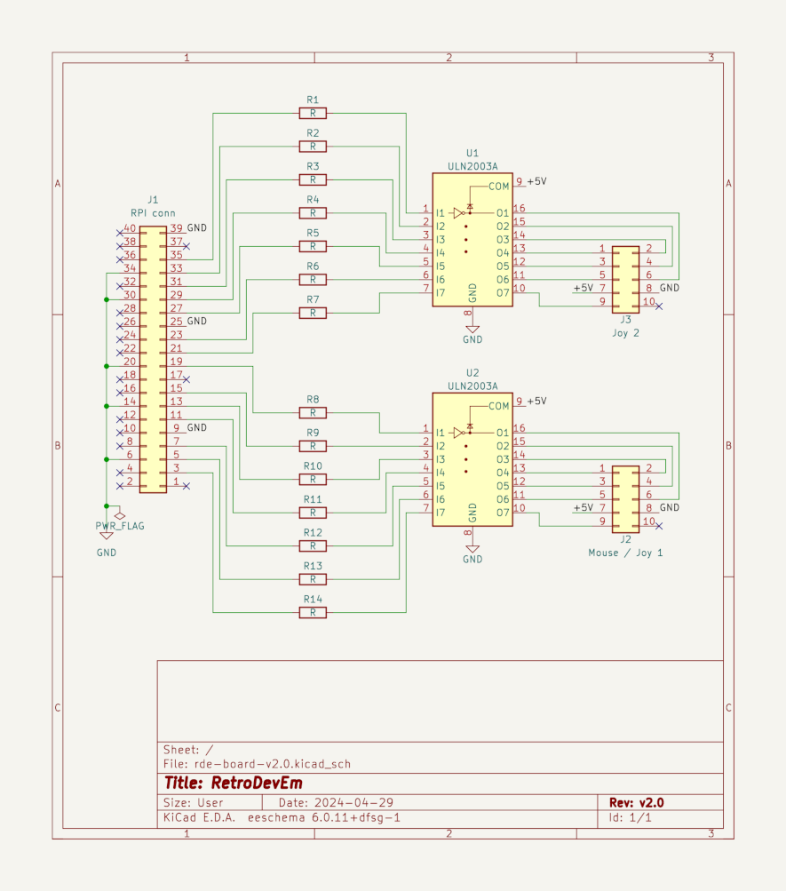

# RetroDevEm

RetroDevEm (Retro Device Emulator) is a free (as in Free Software)
input devices (mouse and joystick) emulator for retro consoles and
computers (Atari 2600, Atari ST, Amstrad CPC, ...).  It allows using
any input device, recognized by Linux on the Raspberry Pi, on
unmodifed retro machines.  Programs collect events from input devices
and send the corresponding signals to the console or computer.

The project consists of 2 components:
- Hardware: A daughter printed circuit board, to be plugged on a Raspberry Pi;
- Software: Programs running on the Raspberry Pi.

## Project focus

This project focuses on:
- Using off the shelf hardware ;
- Devices accuracy and low latency ;
- Simplicity ;
- Low CPU usage.

## Rationale

I bought a 30 Euros Atari ST mouse adapter from a hobbyist.  It only
works with ps/2 mice and the accuracy is okish.  Especially with slow
movements, the Atari ST pointer accuracy is bad.  So why not do
something better and make it free software ?

## Project details

### Hardware

A PCB (Printed Circuit Board), with:
- 2x ULN2003AN ICs (7 Darlington transistors per IC)
- 14 resistors
- 1x 40 pins Raspberry Pi connector
- 2x 9 pins DB9 cables connectors

#### Board wiring

| RPI sig | RPI pin | DB9 pins | ULN2003AN     | Atari ST              | Amstrad CPC      | Atari 2600     |
|---------|---------|----------|---------------|-----------------------|------------------|----------------|
| GPIO2   | 3       | P0 1     |               | P0 XB / Up            | Up               | Up             |
| GPIO3   | 5       | P0 2     |               | P0 XA / Down          | Down             | Down           |
| GPIO4   | 7       | P0 3     |               | P0 YA / Left          | Left             | Left           |
| GPIO17  | 11      | P0 4     |               | P0 YB / Right         | Right            | Right          |
| GPIO27  | 13      | P0 5     |               | P0 Port 0 enable      | Fire 3 (undoc)   | Pot 0 (analog) |
| GPIO22  | 15      | P0 6     |               | P0 Left Button / Fire | Fire 2 (default) | Fire           |
|         |         | P0 7     | COM (flyback) | P0 +5V                | Fire 1 (extra)   | +5V            |
| GND     | 6,9,... | P0 8     |               | P1 GND                | COM1 (GND Joy 1) | GND            |
| GPIO10  | 19      | P0 9     |               | P0 Right Button       | COM2 (GND Joy 2) | Pot 1 (analog) |
| GPIO9   | 21      | P1 1     |               | P1 XB / Up            |                  |                |
| GPIO11  | 23      | P1 2     |               | P1 XA / Down          |                  |                |
| GPIO0   | 27      | P1 3     |               | P1 YA / Left          |                  |                |
| GPIO5   | 29      | P1 4     |               | P1 YB / Right         |                  |                |
| GPIO6   | 31      | P1 5     |               | P1 Port 0 enable      |                  |                |
| GPIO13  | 33      | P1 6     |               | P1 Left Button / Fire |                  |                |
| GPIO19  | 35      | P1 9     |               | P1 Right Button       |                  |                |
|         |         | P1 7     | COM (flyback) | P1 +5V                |                  |                |
| GND     | 6,9,... | P1 8     |               | P1 GND                |                  |                |

### Additional information

#### Consoles and computers DB9 wiring

| DB9 pins | Atari ST  | Atari ST    | Atari ST    | Amstrad CPC      | Atari 2600     |
|          | Mouse P0  | Joystick P0 | Joystick P1 | Joystick         |                |
|----------|-----------|-------------|-------------|------------------|----------------|
| 1        | XB        | Up          | Up          | Up               | Up             |
| 2        | XA        | Down        | Down        | Down             | Down           |
| 3        | YA        | Left        | Left        | Left             | Left           |
| 4        | YB        | Right       | Right       | Right            | Right          |
| 5        |           |             | P0 enable   | Fire 3 (undoc)   | Pot 0 (analog) |
| 6        | Left But  | Fire        | Fire        | Fire 2 (default) | Fire           |
| 7        | +5V       | +5V         | +5V         | Fire 1 (extra)   | +5V            |
| 8        | GND       | GND         | GND         | COM1 (joy1)      | GND            |
| 9        | Right But |             |             | COM2 (joy2)      | Pot 1 (analog  |

Sources:
- [cpcwiki](https://www.cpcwiki.eu/index.php/Connector:Digital_joystick)
- [Atari ST Internals - page 73](https://archive.org/details/Atari_ST-Internals/page/72/mode/2up)

The first version will focus on the following use cases:
- Atari 2600: 1 joystick
- Atari ST: 1 mouse + 1 joystick
- Atari ST: 2 joysticks
- Amstrad CPC: 1 joystick

#### Schematics

### Software

A Python program, running on a Raspberry Pi, processes the events from
an input device and send the corresponding signals to the retro
machine connected to the Raspberry Pi over GPIOs.

- [`atari-mouse.py`](src/atari-mouse.py) emulates the Atari ST mouse.
  Displays latency and sample rate statistics.

## Current status

### Atari ST

Mouse emulation is working nicely.  Latency is below 20 ms (i.e 1
frame at 50 Hz) and CPU usage is below 10% of a core, for normal
usage.

## Links

- [Incremental encoder on Wikipedia][4]: describes the mouse signal
  expected by the Atari ST ;
- [ATARIPiMouse Github][1]: inspiration for writing the emulator in Python ;
- [Yaumataca][2]: inspiration for the "quadrature encoder" ;
- [Atari-Quadrature-USB-Mouse-Adapter][3]

[1]: https://github.com/backofficeshow/ATARIPiMouse
[2]: https://github.com/Slamy/Yaumataca
[3]: https://github.com/jjmz/Atari-Quadrature-USB-Mouse-Adapter
[4]: https://en.wikipedia.org/wiki/Incremental_encoder
