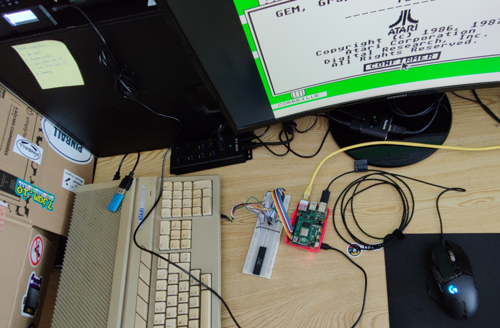

Title: RetroDevEm

RetroDevEm (Retro Device Emulator) is a free (as in Free Software)
input devices (mouse and joystick) emulator for retro consoles and
computers (Atari 2600, Atari ST, Amstrad CPC, ...).  It allows using
any input device, recognized by Linux on the Raspberry Pi, on
unmodifed retro machines.  Programs collect events from input devices
and send the corresponding signals to the console or computer.

# Project focus

This project focuses on:
- Using off the shelf hardware ;
- Devices accuracy and low latency ;
- Simplicity ;
- Low CPU usage.

# Rationale

I bought a 30 Euros Atari ST mouse adapter from a hobbyist.  It only
works with ps/2 mice and the accuracy is okish.  Especially with slow
movements, the Atari ST pointer accuracy is bad.  So why not do
something better and make it free software ?

# Project details

## Hardware

The following hardware is currently used:
- a Raspberry PI (using the RPI 4B, though any should do) ;
- 6 operational amplifiers (using 3 LM358 chips) ;
- 2 resistors greater than 1 KOhms (using 3.5 KOhms resistors) ;
- 1 DB9 female connector ;
- and a bread board with some wires to connect things.

The electronic components only act a buffer between the Raspberry Pi
I/O pins and the machine port.  This may evolve over time.

## Schematics

TBD

## Software

A Python program, running on a Raspberry Pi, processes the events from
an input device and send the corresponding signals to the retro
machine connected to the Raspberry Pi over GPIOs.

- `atari-mouse.py` emulates the Atari ST mouse.  Displays latency and
  sample rate statistics.

# Current status

## Atari ST

Mouse emulation is working nicely.  Latency is below 20 ms (i.e 1
frame at 50 Hz) and CPU usage is below 10% of a core, for normal
usage.

# Links

- [Incremental encoder on Wikipedia][4]: describes the mouse signal
  expected by the Atari ST.
- [ATARIPiMouse Github][1]: inspiration for writing the emulator in Python ;
- [Yaumataca][2]: inspiration for the "quadrature encoder" ;
- [Atari-Quadrature-USB-Mouse-Adapter][3].

[1]: https://github.com/backofficeshow/ATARIPiMouse
[2]: https://github.com/Slamy/Yaumataca
[3]: https://github.com/jjmz/Atari-Quadrature-USB-Mouse-Adapter
[4]: https://en.wikipedia.org/wiki/Incremental_encoder
